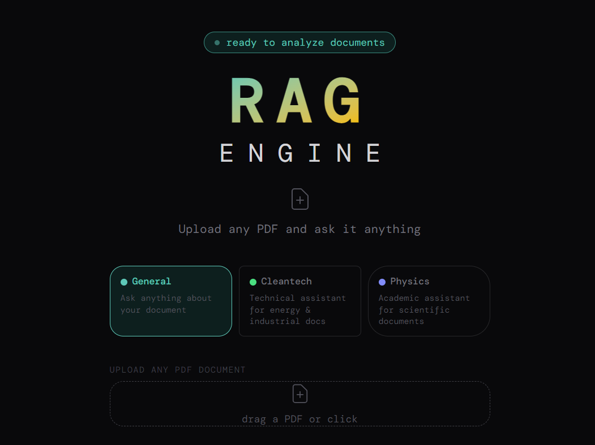

# rag-engine


**[→ Live demo](https://rag-engine-gamma.vercel.app)**

Upload a PDF, DOCX, TXT or MD file and ask it anything. Answers are grounded strictly in the document and include exact citations. Ships with three **skins** — selectable personas that reskin the UI and steer the model toward a domain.



---

## Pipeline

```
INGESTION

  File Upload ──► Text Extraction ──► Recursive Chunking ──► Embedding ──► Supabase
 (PDF/DOCX/TXT/MD)  (unpdf/mammoth)    ~600 tok / 100 tok      (Cohere)    pgvector
                                           overlap           embed-v3.0    HNSW idx


QUERY

  Question ──► Embedding ──► Vector Search ──► Reranking ──► Generation ──► Answer
               (Cohere)       cosine sim        top 5 of     (Cohere)     + citations
             search_query      top 15          rerank-v3   command-r-plus
```

---

## Stack

| Layer | Technology | Notes |
|---|---|---|
| Framework | Next.js 16, TypeScript | App Router, server actions |
| Database | Supabase + pgvector | HNSW index, `match_documents` RPC |
| Embeddings | Cohere `embed-multilingual-v3.0` | 1024 dims, `search_document` / `search_query` |
| Reranking | Cohere `rerank-multilingual-v3.0` | top 15 → top 5 |
| Generation | Cohere `command-r-plus-08-2024` | grounded, citation-aware prompt, auto-detects response language |
| Document parsing | `unpdf` (PDF), `mammoth` (DOCX) | works in serverless, no native deps; TXT/MD read as plain text |
| UI | Tailwind CSS v4, DM Mono | dark theme, per-skin color/radius/background tokens |

---

## Skins

A skin is a UI persona: it swaps the accent palette, border radius, background motif, model preamble and copy — all from a single config object (`lib/skins.ts`). Switching skins keeps a separate chat history per skin but shares the same document corpus.

| Skin | Domain | Accent | Radius | Background |
|---|---|---|---|---|
| **General** | Any document | Teal | `rounded-2xl` (soft) | none |
| **Cleantech** | Energy, district heating, industrial efficiency | Green | `rounded-md` (sharp) | grid |
| **Physics** | Academic / scientific documents | Indigo | `rounded-3xl` (rounded) | dots |

Adding a skin means adding one entry to `lib/skins.ts` — colors, radius, pattern and preamble — no other code changes required.

---

## Features

- **Drag & drop** upload (PDF, DOCX, TXT, MD) with real-time progress feedback
- **Shared multi-document corpus** — add or remove individual files, or replace the whole corpus, without leaving the chat
- **Semantic search** via pgvector cosine similarity
- **Cross-encoder reranking** for precision on top of vector recall
- **Cited answers** — every claim references a specific fragment and its position in the document
- **Three skins** (General / Cleantech / Physics) — distinct color palette, border radius and background pattern per persona, plus a tailored model preamble
- **Auto-detected response language** — the model answers in the language the question was asked in, no manual toggle
- **Inline document management** — add, remove or replace documents mid-conversation without navigating away
- **BYO API key** — users can provide their own Cohere key in the UI
- **Responsive layout** — landing, skin selector and chat all adapt down to mobile widths

---

## Key Technical Decisions

**Two-phase retrieval** — ANN vector search (fast, high recall) retrieves 15 candidates. A cross-encoder reranker (slow, high precision) re-scores them and returns the top 5. Neither alone is sufficient for production quality.

**Input type distinction** — Cohere requires `search_document` at ingestion time and `search_query` at query time. Mixing them silently degrades retrieval.

**Recursive chunking** — Text is split at paragraph → sentence → word boundaries (~600 tokens, ~100 token overlap, min 100 chars), preserving semantic coherence across chunks.

**Shared corpus, per-skin chat** — All ingested documents live in one corpus regardless of active skin; only the chat history and model preamble are scoped per skin. Users manage the corpus explicitly (add / remove / replace all) instead of it being implicitly cleared.

**Skin as a single config object** — Color, radius and background pattern all derive from one `Skin` entry, so the UI never special-cases a skin id outside `lib/skins.ts` — components just read `skin.radius` / `skin.pattern` / `skin.colors`.

**Auto-detected response language** — The model infers the answer language from the question itself, so fragment citations (`Fragment 1` vs `Fragmento 1`) stay consistent without a manual UI toggle.

---

## Database Schema

```sql
create extension if not exists vector;

create table documents (
  id         uuid primary key default gen_random_uuid(),
  content    text not null,
  embedding  vector(1024),
  metadata   jsonb default '{}'::jsonb,
  created_at timestamptz default now()
);

create index on documents using hnsw (embedding vector_cosine_ops);

create or replace function match_documents (
  query_embedding vector(1024),
  match_count     int default 15
)
returns table (id uuid, content text, metadata jsonb, similarity float)
language sql stable as $$
  select id, content, metadata,
    1 - (embedding <=> query_embedding) as similarity
  from documents
  order by embedding <=> query_embedding
  limit match_count;
$$;

grant all on table documents to service_role;
```

---

## Running Locally

**Prerequisites:** Node.js 18+, a [Supabase](https://supabase.com) project with the schema above, a [Cohere](https://cohere.com) API key.

```bash
git clone https://github.com/DavidSerret/rag-engine
cd rag-engine
npm install
```

Create `.env.local`:

```env
NEXT_PUBLIC_SUPABASE_URL=https://your-project.supabase.co
NEXT_PUBLIC_SUPABASE_ANON_KEY=your_supabase_anon_key
SUPABASE_SERVICE_ROLE_KEY=eyJ...
COHERE_API_KEY=...
```

```bash
npm run dev
# → http://localhost:3000
```

---

## Deploy to Vercel

1. Push to GitHub
2. Import at [vercel.com/new](https://vercel.com/new) — set **Root Directory** to `rag-engine`
3. Add the four environment variables from `.env.local` in the Vercel dashboard
4. Deploy

> Vercel's default API route payload limit is 4.5 MB. For larger PDFs, set `bodySizeLimit` in `next.config.ts`.

---

## Project Structure

```
app/
  api/
    ingest/route.ts            # file → text → chunks → embeddings → Supabase
    query/route.ts             # question → embed → search → rerank → generate
    documents/route.ts         # GET corpus filenames, DELETE (replace all)
    documents/[filename]/route.ts  # DELETE a single document
  components/
    Chat.tsx                   # conversation UI, document management, action row
    UploadLanding.tsx          # initial upload screen, title, skin picker
    UploadZone.tsx             # drag & drop multi-format upload
    SkinSelector.tsx           # skin picker (full cards + compact pill variant)
  page.tsx                     # state machine: landing ↔ chat, skin/corpus state
lib/
  chunker.ts                   # recursive text splitting
  cohere.ts                    # shared Cohere client factory
  db.ts                        # Supabase insert, clear, per-file delete
  embedder.ts                  # embed queries and document chunks
  extractor.ts                 # text extraction for PDF / DOCX / TXT / MD
  generator.ts                 # LLM answer generation
  i18n.ts                      # UI strings and base model preamble
  retriever.ts                 # vector search + reranking
  skins.ts                     # skin definitions: colors, radius, pattern, preamble
  types.ts                     # shared Message / chat types
supabase/
  schema.sql                   # full database schema
```
